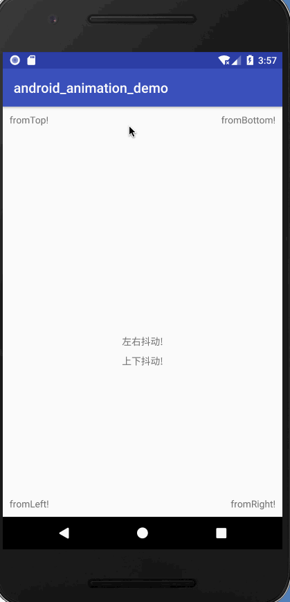
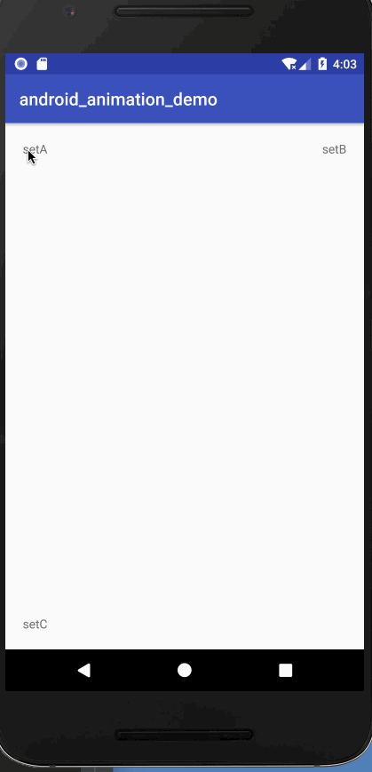

### between动画

###### 从Animation类继承的属性

android:duration        动画持续时间，以毫秒为单位
android:fillAfter       如果设置为true，控件动画结束时，将保持动画最后时的状态
android:fillBefore      如果设置为true,控件动画结束时，还原到开始动画前的状态
android:fillEnabled     与android:fillBefore 效果相同，都是在动画结束时，将控件还原到初始化状态
android:repeatCount     重复次数
android:repeatMode	    重复类型，有reverse和restart两个值，reverse表示倒序回放，restart表示重新放一遍，必须与repeatCount
一起使用才能看到效果。因为这里的意义是重复的类型，即回放时的动作。
android:interpolator    设定插值器

animation的常用子类：
`ScaleAnimation `, `TranslateAnimation`, ` RotateAnimation`, `AlphaAnimation`

###### ScaleAnimation
ScaleAnimation 在xml中对应的是 <scale>标签，可以实现缩放动画效果，下面是自有属性：

* android:fromXScale :  起始的X方向；浮点值，1.0代表自身无变化，小于1.0代表缩小，大于1.0代表放大；
* android:toXScale :  结尾的X方向；
* android:fromYScale : 起始的Y方向，取值与X相同；
* android:toYScale : 结尾的Y方向；
* android:pivotX : 动画开始的X参照中心点，取值可以是 ` 数值 `，` 百分数 `, ` 百分数p ` 三种。比如 50、50%、50%p，当为数值时，表示在当前View的左上角，即原点处加上50px，做为起始缩放点；
如果是50%，表示在当前控件的左上角加上自己宽度的50%做为起始点；如果是50%p，那么就是表示在当前的左上角加上父控件宽度的50%做为起始点x轴坐标。
* android:pivotY           缩放起点Y轴坐标，取值及意义跟android:pivotX一样。

###### TranslateAnimation
TranslateAnimation 在xml中对应的是<translate>标签，可以实现平移的动画效果，下面是自有属性：

* android:fromXDelta       起始点X轴坐标，可以是数值、百分数、百分数p 三种样式，比如 50、50%、50%p，具体意义已在scale标签中讲述，这里就不再重讲
* android:fromYDelta       起始点Y轴从标，可以是数值、百分数、百分数p 三种样式；
* android:toXDelta         结束点X轴坐标
* android:toYDelta         结束点Y轴坐标

###### RotateAnimation
RotateAnimation 在xml中对应的是 <rotate>标签，可以实现旋转的动画效果，下面是自有属性：

* android:fromDegrees     开始旋转的角度位置，正值代表顺时针方向度数，负值代码逆时针方向度数
* android:toDegrees       结束时旋转到的角度位置，正值代表顺时针方向度数，负值代表逆时针方向度数
* android:pivotX          缩放起点X轴坐标，可以是数值、百分数、百分数p 三种样式，比如 50、50%、50%p，具体意义已在scale标签中讲述，这里就不再重讲
* android:pivotY          缩放起点Y轴坐标，可以是数值、百分数、百分数p 三种样式，比如 50、50%、50%p

###### AlphaAnimation
AlphaAnimation 在xml中对应的是 <alpha>标签，可以实现隐藏效果；

* android:fromAlpha     动画开始的透明度，从0.0 --1.0 ，0.0表示全透明，1.0表示完全不透明
* android:toAlpha       动画结束时的透明度，也是从0.0 --1.0 ，0.0表示全透明，1.0表示完全不透明

效果：
gif图片有点卡；

---

