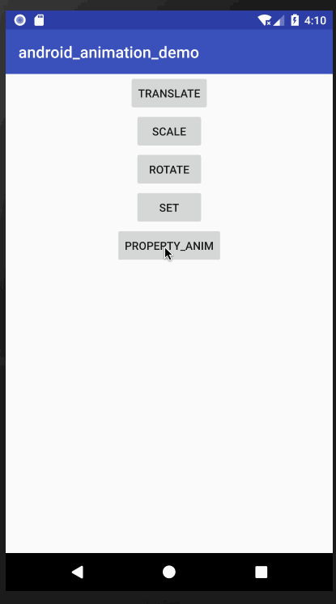

### 一，between动画


###### 从Animation类继承的属性

android:duration        动画持续时间，以毫秒为单位
android:fillAfter       如果设置为true，控件动画结束时，将保持动画最后时的状态
android:fillBefore      如果设置为true,控件动画结束时，还原到开始动画前的状态
android:fillEnabled     与android:fillBefore 效果相同，都是在动画结束时，将控件还原到初始化状态
android:repeatCount     重复次数
android:repeatMode	    重复类型，有reverse和restart两个值，reverse表示倒序回放，restart表示重新放一遍，必须与repeatCount
一起使用才能看到效果。因为这里的意义是重复的类型，即回放时的动作。
android:interpolator    设定插值器

animation的常用子类：
`ScaleAnimation `, `TranslateAnimation`, ` RotateAnimation`, `AlphaAnimation`


###### ScaleAnimation
ScaleAnimation 在xml中对应的是 <scale>标签，可以实现缩放动画效果，下面是自有属性：

* android:fromXScale :  起始的X方向；浮点值，1.0代表自身无变化，小于1.0代表缩小，大于1.0代表放大；
* android:toXScale :  结尾的X方向；
* android:fromYScale : 起始的Y方向，取值与X相同；
* android:toYScale : 结尾的Y方向；
* android:pivotX : 动画开始的X参照中心点，取值可以是 ` 数值 `，` 百分数 `, ` 百分数p ` 三种。比如 50、50%、50%p，当为数值时，表示在当前View的左上角，即原点处加上50px，做为起始缩放点；
如果是50%，表示在当前控件的左上角加上自己宽度的50%做为起始点；如果是50%p，那么就是表示在当前的左上角加上父控件宽度的50%做为起始点x轴坐标。
* android:pivotY           缩放起点Y轴坐标，取值及意义跟android:pivotX一样。


###### TranslateAnimation
TranslateAnimation 在xml中对应的是<translate>标签，可以实现平移的动画效果，下面是自有属性：

* android:fromXDelta       起始点X轴坐标，可以是数值、百分数、百分数p 三种样式，比如 50、50%、50%p，具体意义已在scale标签中讲述，这里就不再重讲
* android:fromYDelta       起始点Y轴从标，可以是数值、百分数、百分数p 三种样式；
* android:toXDelta         结束点X轴坐标
* android:toYDelta         结束点Y轴坐标


###### RotateAnimation
RotateAnimation 在xml中对应的是 <rotate>标签，可以实现旋转的动画效果，下面是自有属性：

* android:fromDegrees     开始旋转的角度位置，正值代表顺时针方向度数，负值代码逆时针方向度数
* android:toDegrees       结束时旋转到的角度位置，正值代表顺时针方向度数，负值代表逆时针方向度数
* android:pivotX          缩放起点X轴坐标，可以是数值、百分数、百分数p 三种样式，比如 50、50%、50%p，具体意义已在scale标签中讲述，这里就不再重讲
* android:pivotY          缩放起点Y轴坐标，可以是数值、百分数、百分数p 三种样式，比如 50、50%、50%p


###### AlphaAnimation
AlphaAnimation 在xml中对应的是 <alpha>标签，可以实现隐藏效果；

* android:fromAlpha     动画开始的透明度，从0.0 --1.0 ，0.0表示全透明，1.0表示完全不透明
* android:toAlpha       动画结束时的透明度，也是从0.0 --1.0 ，0.0表示全透明，1.0表示完全不透明


###### 插值器   

| java 类  | xml id  |  描述   |
| :------  | :------ | :----- | 
| AccelerateDecelerateInterpolator  | @android:anim/accelerate_decelerate_interpolator |  动画始末速率较慢，中间加速         |    
| AccelerateInterpolator            | @android:anim/accelerate_interpolator            |  动画开始速率较慢，之后慢慢加速      |    
| AnticipateInterpolator            | @android:anim/anticipate_interpolator            |  开始的时候从后向前甩              |    
| AnticipateOvershootInterpolator   | @android:anim/anticipate_overshoot_interpolator  |  类似上面AnticipateInterpolator |    
| BounceInterpolator                | @android:anim/bounce_interpolator                |  动画结束时弹起  
| CycleInterpolator                 | @android:anim/cycle_interpolator                 |  循环播放速率改变为正弦曲线    
| DecelerateInterpolator            | @android:anim/decelerate_interpolator            |  动画开始快然后慢   
| LinearInterpolator                | @android:anim/linear_interpolator                |  动画匀速改变  
| OvershootInterpolator             | @android:anim/overshoot_interpolator             |  向前弹出一定值之后回到原来位置 
| PathInterpolator                  |                                                  |  新增，定义路径坐标后按照路径坐标来跑    


效果：
gif图片有点卡；


---


### 二，Property Animation

[属性动画官方文档](https://developer.android.com/guide/topics/graphics/prop-animation)

补间动画只能对view视图进行动画处理，如果要为非view对象设置动画效果，比如为自定义对象 `MyPoint` 
进行动画操作，补间动画就不行了，这时候就需要属性动画了。补间动画能做到的，属性动画都可以做到，补间动画做不到的，属性动画也能做到。     
下面列举一些简单的例子，供初学者使用： 
   

渐变动画：    
```
 fun alpha(){
        //后面可以传多个值，
        val animator = ObjectAnimator.ofFloat(property_anim_btn,"alpha", 1f, 0f, 1f/*, 0f, 1f,
         0f*/)
        //-1 代表一直重复
        animator.repeatCount = -1
        animator.duration = 2000
        animator.start()
    }


```


旋转动画：   

```
   fun rotation(){
        //下个度数大于上个度数，顺时针旋转；下个度数小于上个度数，逆时针旋转; 下面的代码意思是，先顺时针旋转360度，再逆时针旋转720度

        //property 取值为 'rotation'，'rotationX'，'rotationY'
        val animator = ObjectAnimator.ofFloat(property_anim_btn, "rotation", 0f,360f, -720f)
        animator.duration = 3000
        animator.repeatCount = -1
        animator.start()
    }

```

平移动画：    

```
 fun translation(){
        //translationX：下个位置大于上个上个位置时，向右移动，反之向左移动；
        //translationY：下个位置大于上个上个位置时，向下移动，反之向上移动。

        //property 取值为 'translationX', 'translationY'
        val animator = ObjectAnimator.ofFloat(property_anim_btn, "translationX", 0f, -300f, 0F)
        animator.duration = 2000
        animator.repeatCount = -1
        animator.start()
    }
```

缩放动画：    

```
  fun scale(){

        //property取值为 'scaleX', 'scaleY'
        val animator = ObjectAnimator.ofFloat(property_anim_btn, "scaleX", 1f, 0f, 1f)
        animator.duration = 2000
        animator.interpolator = AccelerateInterpolator(2f);
        animator.repeatCount = -1
        animator.start()
    }
```

组合动画：   

```
/**
     * 动画集合，提供把多个动画组合成一个组合的机制，并可设置动画的时序关系，如同时播放、顺序播放或延迟播放。具体使用方法比较简单，
     */
    fun animatorSetA(){
        val a1 = ObjectAnimator.ofFloat(property_anim_btn, "alpha", 1.0f,0f, 1.0f)
        a1.repeatCount = -1

        val a2 = ObjectAnimator.ofFloat(property_anim_btn, "translationX", 0f, 300f, 0f)
        a2.repeatCount = -1

        val a3 = ObjectAnimator.ofFloat(property_anim_btn, "rotation", 0f, 360f, 0f)
        a3.repeatCount = -1

        val a4 = ObjectAnimator.ofFloat(property_anim_btn, "scaleX", 1f, 0f, 1f)
        a4.repeatCount = -1

        val a5 = ObjectAnimator.ofFloat(property_anim_btn, "scaleY", 1f, 0f, 1f)
        a5.repeatCount = -1


        val animSet = AnimatorSet()
        animSet.duration = 2000
        animSet.interpolator = LinearInterpolator()
        animSet.play(a1).with(a2).with(a3).with(a4).with(a5)
        animSet.start()

    }

```

效果图：   

